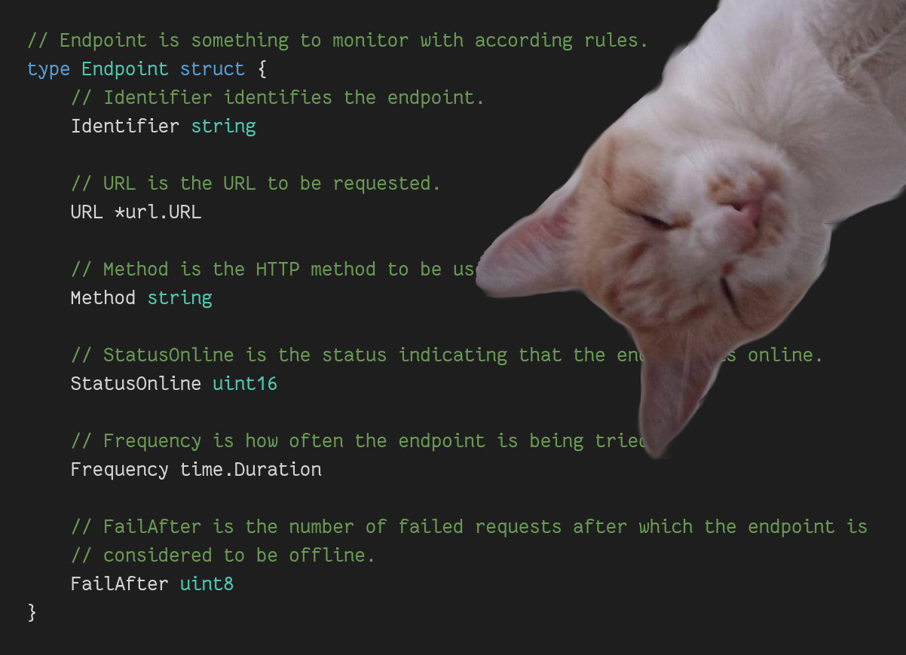

# meow: Monitor Endpoints on (the) Web

meow is a simple monitoring system for unauthenticated HTTP endpoints.

meow consists of the following components:

1. A configuration server to manage the endpoints to be monitored.
2. The actual monitoring daemon performing the requests.
3. An alerting server to notify endpoints that went offline (and back online).

## Configuration Server (`configCmd/config.go`)

Run it with an existing configuration CSV file (to be overwritten):

    go run configCmd/config.go -file sample.cfg.csv

A configuration defines multiple endpoints, each consisting of the following
indications:

1. URL: The URL of the endpoint to be monitored.
2. Method: The HTTP method to be used for the request (e.g. `GET`, `HEAD`).
3. StatusOnline: Response HTTP status code indicating success (e.g. `200`).
4. Frequency: How often the request should be performed (e.g. `1m30s`).
5. FailAfter: After how many failing requests the endpoint is considered offline.
